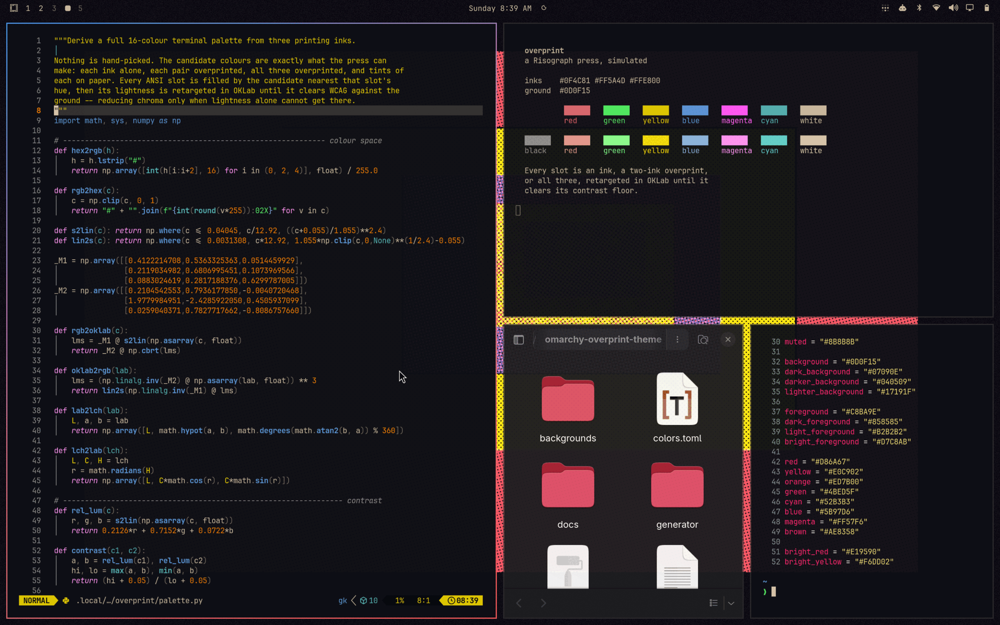

# Overprint

An Omarchy theme that simulates a Risograph press.

Three inks, halftone screens at 15/75/45 degrees, subtractive overprint on paper
and screen-blend on dark grounds, paper grain, deliberate misregistration. The
palette is not chosen — every ANSI colour is an ink, a two-ink overprint, or all
three, retargeted in OKLab until it clears its contrast target against the actual
ground it sits on.



## Install

```
omarchy theme install https://github.com/slhuckstead/omarchy-overprint-theme.git
```

That is the whole theme: palette, six wallpapers, shell surfaces, lock and
boot screens. It adds nothing to your system beyond a theme directory.

For the boot screen:

```
omarchy plymouth set-by-theme overprint
```

## Six shipped, 132 available

The repo ships six — one per composition family, spread across all four
presses and all three grounds. The generator makes the full set — four ink sets
("presses") × three ground weights × eleven compositions — locally:

```
python3 generator/generate.py
```

Needs `python3`, `numpy` and `magick`. Takes about six minutes and writes roughly
330MB, which is why they are not in git.

It writes them to **two** places: the six that ship stay in the theme
directory, and the other 126 go to `~/.config/omarchy/backgrounds/overprint/`.
Omarchy enumerates both when cycling backgrounds, so all 132 are in the rotation
either way. The split matters because `omarchy theme install` does `rm -rf` on
the theme directory before cloning — anything kept there is destroyed by
reinstalling or updating the theme, and anything in the user directory
survives.

`generator/generate.py --palette` rebuilds only `colors.toml`, in under a second.
Use that when tuning colour; it avoids rewriting every image underneath a theme
you currently have applied.

## Wallpaper aspect

The wallpapers here are **16:9 at 3840x2160**. Omarchy hangs them with
`Image.PreserveAspectCrop`, so a mismatch between image and panel comes off the
edges — and these compositions are nested golden-ratio fields, so a crop
re-proportions the thing the composition is. 16:9 is exact on 1080p, 1440p and
4K; a 16:10 panel loses 10% of width, an ultrawide 26% of height.

If you want your own panel exactly:

```
python3 generator/generate.py --for-display
```

That reads your focused monitor and re-renders at its resolution — a re-render,
not a resize, so the halftone scales with the frame instead of being stretched.

## The picker card

Every first-party Omarchy theme ships a **screenshot of a working desktop** as
its `preview.png` — bar, tiled terminals, file manager, borders, wallpaper
behind. This repo ships a wallpaper, which answers a different question in the
picker. To make a proper one:

```
optional/bin/overprint-make-preview                  # the current theme
optional/bin/overprint-make-preview overprint-light  # a named one
```

It applies the theme, waits while you arrange a workspace, then captures and
writes `preview.png` and `preview-unlock.png` at 2880x1800 — the size solitude
and last-horizon use. It asks you to do the arranging because switching
workspaces needs a real session; tooling that tries it gets no effect and
captures whatever you had open instead.

## Publishing a fork

`omarchy theme install` derives one theme per repo name, so a variant needs its
own repo — that is why the two below live separately rather than as branches
here. If you change the inks and want to publish the result:

```
python3 generator/generate.py --dist       ~/src/omarchy-yourtheme-theme
python3 generator/generate.py --dist --light ~/src/omarchy-yourtheme-light-theme
```

Each export is self-contained — palette, shell surfaces, wallpapers, previews,
the generator, README and LICENSE — so it can be `git init`ed and pushed as-is.
Set `OVERPRINT_REPO` and `OVERPRINT_AUTHOR` first and the generated README and
LICENSE will name your repo rather than this one.

## The other two grounds

Same three inks, different sheet. Installable the same way, since Omarchy
derives one theme per repo (Catppuccin / Catppuccin Latte):

```
omarchy theme install https://github.com/slhuckstead/omarchy-overprint-slate-theme.git
omarchy theme install https://github.com/slhuckstead/omarchy-overprint-light-theme.git
```

| | ground | for |
|---|---|---|
| [Overprint](https://github.com/slhuckstead/omarchy-overprint-theme) | `#0D0F15` | a dark room |
| [Overprint Slate](https://github.com/slhuckstead/omarchy-overprint-slate-theme) | `#212329` | daylight |
| [Overprint Light](https://github.com/slhuckstead/omarchy-overprint-light-theme) | `#DAD6CE` | paper |

Each carries the same six compositions on the same presses, moved to its own
ground, so the three read as one theme in three weights rather than three
themes. Or build them here instead, which takes about two minutes each:

```
python3 generator/generate.py --slate
python3 generator/generate.py --light
```

Slate is the one for a bright room: `themes.py` calls it the lifted ground that
survives glare, where the night ground washes out and paper glares back. Its
inks come out paler than night's, which is not a fault — on a lifted ground
higher contrast means lighter.

The light palette is not the dark one inverted, and could not be. Contrast is
solved against `selection`, and the ceiling there belongs to the ground: 15.59:1
on the night ground, **11.51:1** on paper. Paper reflects, so a light theme has
*less* headroom, not more — `green`'s dark target plus its bright delta asks for
12.1:1, which no colour of any hue can reach there, and the old foreground
target demanded a colour darker than black. Darkening the paper makes it worse,
not better, because `selection` darkens with it.

So `SLOT_CONTRAST_LIGHT` is a separate, searched set. Compressing the dark
targets proportionally cleared contrast but left three protanopia collisions:
under colour-vision deficiency hue separation is gone, so the contrast targets
*are* the separation.

More generally, targets follow the **ground's ceiling**, not light versus dark.
Measured against `selection`: night 15.59:1, slate 11.47:1, day 11.51:1. Slate
is a lifted dark ground, so its gap to white is squeezed exactly as paper
squeezes the gap to black — which is why it wants day's numbers, not night's.
`SLOT_CONTRAST_BY_LEVEL` is keyed by level for that reason, and night is the odd
one out only because it is the only ground with real headroom. All three pass
`--check` with no fallbacks and no collisions.

## What gets themed

`colors.toml` is the palette. Two things beyond it are worth calling out, because
most themes leave them to Omarchy's generic fallback:

**The window border is three inks.** `hyprland_active_border` is an ink, then
what those two inks *actually* make where they overlap on this ground, then the
other ink. It is the only place in the theme where an overprint is visible as
itself. Raw inks cannot be used for this — measured against the night ground,
`#0F4C81` is 2.16 contrast (invisible as a border) and `#FFE800` is 15.32
(glare) — so every stop is retargeted to the accent's own weight. The angle is
45°, not the 15° primary screen angle, because at `border_size = 2` a 15°
gradient collapses to flat colour on the side edges. At 6px it looks fine, which
is the trap.

**`shell.toml` is included**, so the bar, launcher, menu, notifications, polkit
and lock screen are themed as one surface. Omarchy generates a generic one from
`colors.toml` when a theme ships none; shipping ours replaces it entirely. Two
differences matter:

- The gradient means exactly one thing — *this window is active*. The generic
  file points every card in the shell at that same token, so tooltips and
  notifications end up wearing a three-ink gradient too, and a gradient on
  everything signals nothing. Here the only other surface that gets it is the
  lock screen while you are typing, which is a real active state.
- Interaction states climb through **ink**, not through four opacities of one
  grey. Hover and keyboard cursor in the primary ink; focus the same ink with a
  much harder edge, a registration mark rather than a glow; selection as ink
  laid down, edged in the overprint colour — which appears nowhere else in the
  shell, and is what makes a selected row read as printed rather than
  highlighted.

## Making it yours

Everything derives from `generator/themes.py`:

```python
INKS = { "harbour": ["#0F4C81", "#FF5A4D", "#FFE800"], ... }
CANON_PRESS = "harbour"     # which ink set the palette is built from
CANON_LEVEL = "night"       # and which ground weight
```

Change the inks, run `generate.py`, and the palette, the wallpapers and the
screensaver all follow — they read from the same three colours.

Two things worth knowing before you tune:

Before you ship a tuned palette, check it:

```
python3 generator/generate.py --check
```

That compares every pair of the fourteen meaning-carrying slots under normal
vision and under simulated protanopia, deuteranopia and tritanopia, and fails if
two of them are too close to tell apart. Contrast alone will not catch this — a
colour can clear its contrast target and still be indistinguishable from its
neighbour, which is the failure that actually breaks a palette. All three
grounds pass today with no fallbacks and no collisions; `--check` with no
argument gates on the canon ground alone and reports the others.

- **Contrast targets are per-hue and deliberately not uniform**
  (`palette.py: SLOT_CONTRAST`). A uniform target flattens lightness across the
  palette to below a just-noticeable difference, which leaves hue as the only
  thing separating two slots — exactly what colour-vision deficiency takes away.
  Measured, a uniform-target build scored 3–4× *worse* for deuteranopes than
  naive terminal defaults.
- **They are tuned for a dark ground.** A deeper ground compresses perceived
  lightness but leaves more headroom before white. The same numbers on a lifted
  ground drive the `bright_*` slots to pure white.

## Optional: screensaver, backlight and ground

None of it is needed for the theme. All of it is opt-in and reversible:

```
optional/install.sh          # explains each part and asks
optional/uninstall.sh        # removes everything it added
```

**Screensaver** — a drifting ink field in your theme's colours, five variations,
one picked at random per sleep. `--mode NAME` forces one, `--list` names them,
`--dump out.png 40` renders a frame offline.

Be aware of what installing it does, because Omarchy has no setting for a custom
screensaver. `idle.screensaverCommand` in `shell.json` looks like one and is not:
nothing reads it, and nothing warns you that nothing reads it. The idle service
hardcodes `omarchy-launch-screensaver`. So the installer:

1. moves `~/.local/bin` to the **front** of `PATH` via a fenced block in
   `~/.bashrc` — after which anything you put there shadows a system command of
   the same name; and
2. generates `~/.local/bin/omarchy-launch-screensaver` from your installed copy of
   Omarchy's, pointing the inner command at this renderer. You will not pick up
   upstream changes to that script until you re-run
   `overprint-make-launcher-shadow`.

If either is unwelcome, skip it. The installer asks first and explains both.

**Backlight adapter** — ramps the backlight to match room light every ten
minutes. With no ambient light sensor it uses the **webcam**, with exposure
locked; the LED blinks on each sample. It never stores an image, only a single
average brightness number. The shipped knee came off one particular panel and
camera and means nothing on yours — run `optional/calibrate.sh`.

**Ground adaptation** — the same ten-minute tick can also move you between the
three grounds as the room or the day changes. It is **installed off**, and stays
off until you both switch it on and calibrate it.

```
overprint-appearance ground sensor   the room decides, from the camera
overprint-appearance ground solar    the sun decides; never opens the camera
overprint-appearance ground both     sensor leads, solar covers for it
overprint-appearance ground agree    switch only when the two concur
overprint-appearance ground off      stop
overprint-appearance day|slate|night switch by hand, once
```

Switching ground switches theme, because that is how Omarchy does variants — but
it **keeps the composition you are on**. `overprint-ground` reads the current
wallpaper's `<press>-<ground>-<composition>` name and places the same
composition on the new ground, so the desktop changes weight without scrambling
the picture. Left to itself `omarchy theme set` advances to the *next* wallpaper
in the new theme, which is intolerable once something automatic is doing it.

`sensor` needs two thresholds and **there are none to ship**. A 0-255 average
behind a locked exposure depends on the sensor, the lens, where the machine sits
and which way the window faces. Nor can two button presses give them: that gets
you the extremes, and what you need are the two *boundaries* between three
grounds, which sit in the middle of the distribution. So:

```
overprint-calibrate-ground --start    then use the machine for a full day
overprint-calibrate-ground            shows the profile and proposes the splits
overprint-calibrate-ground --apply    writes them
overprint-calibrate-ground --forget   deletes the recording
```

It clusters a day of readings into three and refuses to propose anything unless
the clusters are separated by more than both the noise inside them and the
hysteresis band — asked for three groups, k-means will always find three, even
in a room whose light never changes.

**On the camera and the journal.** The lens is opened only if something actually
asked for a reading: backlight adaptation on, a sensor-driven ground, or
calibration recording. Solar plus `BRIGHTNESS=off` never opens it at all, and
that check sits at the call site rather than somewhere downstream of it. The
journal gets decisions, not measurements — no light readings, no coordinates,
no sunrise/sunset times, because this runs every ten minutes forever into a
persistent log and a numeric light series is a record of when you were at your
desk. `OVERPRINT_DEBUG=1` for the numbers. Solar takes its coordinates from
`/etc/localtime` and contacts nothing; `LOCATE=ip` permits one lookup as a
fallback and is off by default.

## Credits and licence

MIT. See `LICENSE`.

`overprint-make-launcher-shadow` derives a script from Omarchy's own
`omarchy-launch-screensaver` (MIT, [basecamp/omarchy](https://github.com/basecamp/omarchy))
at install time, rather than redistributing a copy that would go stale.

The palette is verified rather than asserted. If you change the inks, measure the
result — every hue against all three grounds that carry text (`background`,
`selection`, `lighter_background`), the closest pair in OKLab, and red against
green under a deuteranopia simulation. An earlier version of this generator
reported "0 contrast failures, 0 collisions" while both were false, because it
only ever checked one of the three grounds and scored a hue it then overwrote
before emitting. Do not trust a generator's report of its own work, including
this one's.
